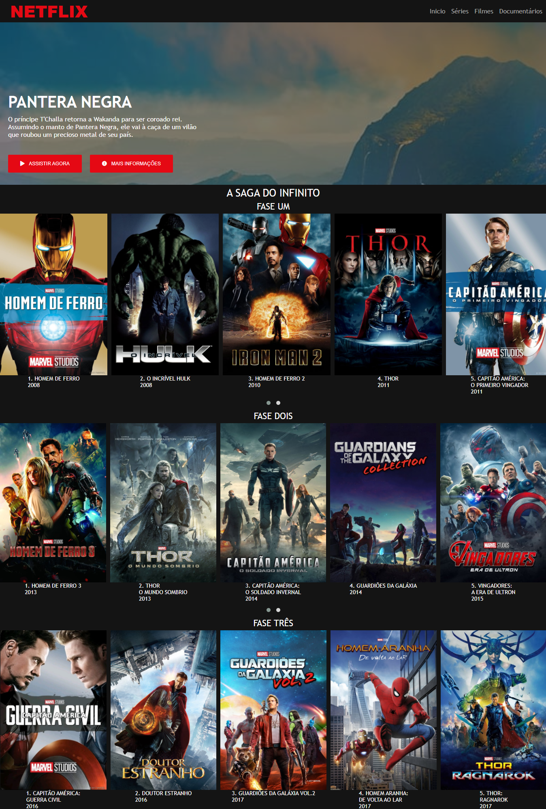

# Recriando a interface do Netflix  💻 - DIO

## Bootcamp - [HTML Web Developer](https://web.digitalinnovation.one/track/html-web-developer):

### Projeto  2:

Repositório do projeto prático proposto na aula do Bootcamp - HTML Web Developer da [Digital Innovation One](https://web.digitalinnovation.one/), ministrada pelo especialista **Felipe Aguiar** , com o desafio de desenvolver uma interface com uma nova roupagem inspirada pela interface do principal site de streaming mundial (Netflix).

### Tecnologias Usadas:

   

### Preview:

<h1>
    
</h1>

Link para visualizar: [Clique aqui](https://PatriciaRodriguesR.github.io/DIO-recriando-interface-netflix/)

Made with 💜 by [**Patrícia Rodrigues**](https://github.com/PatriciaRodriguesR/) 👋

